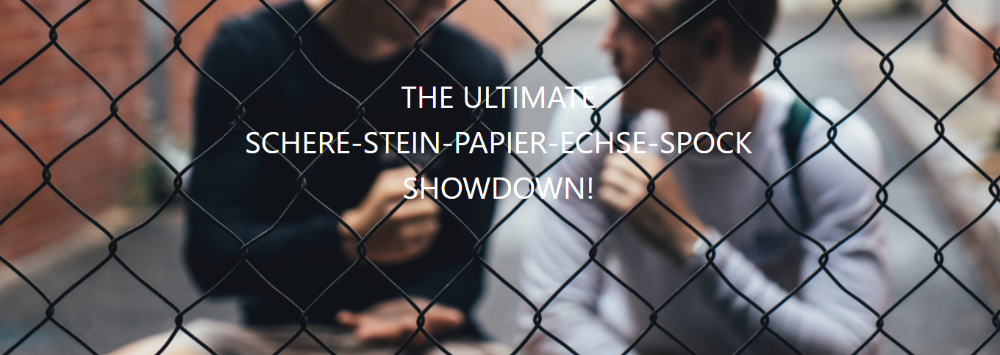
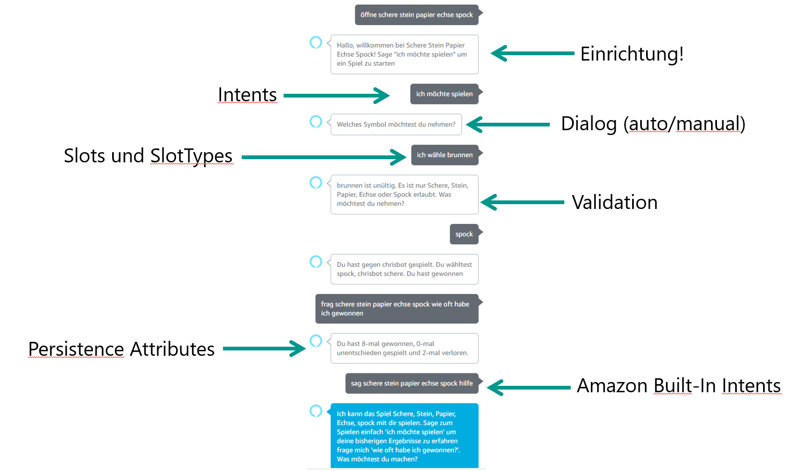
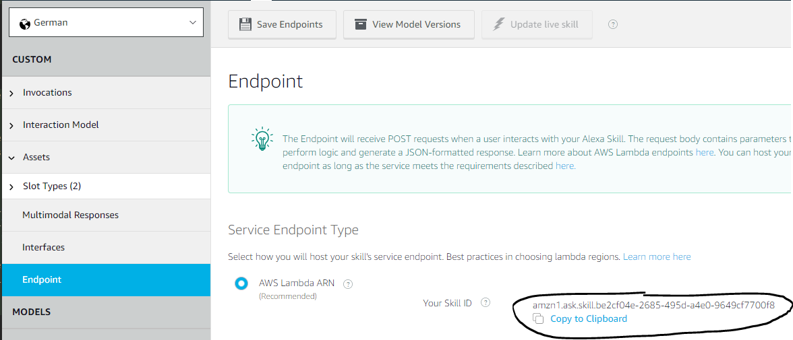
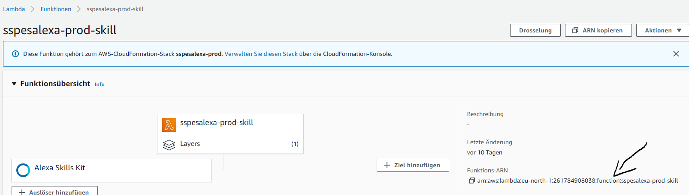
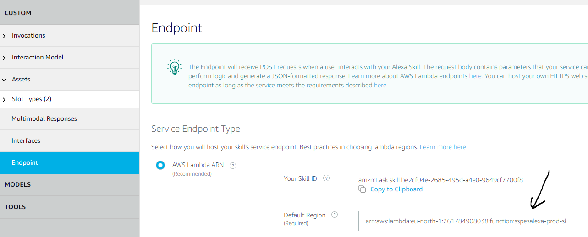

Dies ist der Alexa Code für "THE ULTIMATE SCHERE-STEIN-PAPIER-ECHSE-SPOCK SHOWDOWN". Der Code wird vom "Serverless AWS Lambda und Alexa"-Workshop verwendet. Er dient dazu spielerisch zu lernen, wie man einen Alexa Skill entwickelt.

In dieser Datei (README) können alle Schritte nachvollzogen werden.

# Ziel

Der Skill ermöglicht in der finalen Stufe folgenden Dialog:



# Schritt 1 - Neues Lambda Serverless Projekt anlegen

* Projekt anlegen. Im Terminal:

`serverless create --template aws-java-maven --name sspes-alexa` 

* ASK SDK hinzufügen, in der pom.xml

```xml
        <dependency>
            <groupId>com.amazon.alexa</groupId>
            <artifactId>ask-sdk</artifactId>
            <version>2.37.1</version>
        </dependency>
```

* RequestHandler implementieren

```java
public class SayHello implements RequestHandler {

    @Override
    public boolean canHandle(HandlerInput input) {
        return input.matches(requestType(LaunchRequest.class));
    }

    @Override
    public Optional<Response> handle(HandlerInput input) {
        ResponseBuilder responseBuilder = input.getResponseBuilder();
        String helloText = "Hallo, willkommen bei Schere Stein Papier Echse Spock! Sage \"ich möchte spielen\" um ein Spiel zu starten";
        return responseBuilder
                .withSpeech(helloText)
                .withShouldEndSession(false)
                .build();
    }
}
```

* SkillStreamHandler implementieren
```java
public class AlexaHandler extends SkillStreamHandler {

    public AlexaHandler() {
        super(Skills
                .standard()
                .addRequestHandlers(
                        new SayHello()
                )
                .withSkillId("amzn1.ask.skill...")
                .build());
    }

}
```
*Tip: Die Alexa Skill ID bekommt man der Developer Console unter "Endpoint"*



* SkillStreamHandler als Handler als Lambda Function publizieren in der serverless.yaml

```yaml
functions:
  skill:
    handler: de.cweyermann.sspes.alexa.AlexaHandler
    events:
      - alexaSkill: amzn1.ask.skill...
    timeout: 60
```

* Funktion deployen, dazu im Terminal

```shell script
mvn install && serverless deploy
```

* ARN der Lambda Funktion im Endpoint eintragen





# Schritt 2 - Intent anlegen

* Neuen RequestHandler anlegen

```java
public class Spielen implements RequestHandler {

    @Override
    public boolean canHandle(HandlerInput input) {
        return input.matches(intentName("Spielen")); // dies muss der Name des Intents auf der Console sein
    }

    @Override
    public Optional<Response> handle(HandlerInput in) {
            return in
                    .getResponseBuilder()
                    .withSpeech("Toll! Ich antworte dir jetzt!")
                    .withShouldEndSession(true)
                    .build();
    }
}   
```

* RequestHandler registrieren

```java
public class AlexaHandler extends SkillStreamHandler {

    public AlexaHandler() {
        super(Skills
                .standard()
                .addRequestHandlers(
                        new SayHello(),
                        new Spielen() // <-- hier hinzufügen
                )
                .withSkillId("amzn1.ask.skill...")
                .build());
    }

}
```

# Schritt 3 - Slots auslesen

```java
IntentRequest intent = (IntentRequest) in.getRequestEnvelope().getRequest();
Map<String, Slot> slots = intent.getIntent().getSlots();
String yourChoice = slots.get("option").getValue(); // "option" muss gleich dem Slot Namen der Console sein
```

# Schritt 4 - SlotType anpassen

* Nichts zu tun ... ;)

# Schritt 5 - Einbindung SSPES-Api

* Auschecken und Bauen der SSPES API von Github. Im Terminal

```shell script
git clone https://github.com/chris2k2/sspes-layer
cd sspes-layer
mvn clean install
```

* Einbinden in **dieser** pom.xml

```xml
<dependency>
    <groupId>de.cweyermann.sspes</groupId>
    <artifactId>sspes-layer</artifactId>
    <version>1.0</version>
</dependency>
``` 
* Erzeugen der API und aufruf von playUnrankedAgainstRandom im Spielen Intent in der `handle` Methode

```java
        SspesAPI api = new SspesAPI();
        MatchResult matchResult = api.playUnrankedAgainstRandom(yourChoice);

        String speechResult = MessageFormat.format("Du hast gegen {0} gespielt. Du wähltest {1}, {0} {2}. Du hast {3}",
                matchResult.getOpponentName(),
                yourChoice,
                matchResult.getOpponentChoice(),
                matchResult.getResult().getAussprache());

        return in.getResponseBuilder()
                .withSpeech(speechResult)
                .withShouldEndSession(true)
                .build();
```

* Rechte für die Datebank in der serverless.yaml vergeben. Dazu unter `providers` folgendes hinzufügen

```yaml
  iamRoleStatements:
    - Effect: 'Allow'
      Action:
        - cloudwatch:*
      Resource: "*"
    - Effect: 'Allow'
      Action:
        - dynamodb:*
      Resource: "arn:aws:dynamodb:eu-north-1:*:*"
```

# Schritt 6 - Validierung anbinden

* Nichts zu tun ... ;)


# Schritt 7 - Hilfe Intent implementieren

* Intent implementieren

```java
public class Hilfe implements RequestHandler {

    @Override
    public boolean canHandle(HandlerInput input) {
        return input.matches(intentName("AMAZON.HelpIntent"));
    }

    @Override
    public Optional<Response> handle(HandlerInput input) {
                return input
                .getResponseBuilder()
                .withSpeech("Ich kann das Spiel Schere, Stein, Papier, Echse, spock mit dir spielen. Sage zum Spielen einfach 'ich möchte spielen' um deine bisherigen " +
                        "Ergebnisse zu erfahren frage mich 'wie oft habe ich gewonnen?'. Was möchtest du machen?" )
                .withShouldEndSession(false)
                .build();
    }

}
```

* Intent registrieren

```java
public class AlexaHandler extends SkillStreamHandler {

    public AlexaHandler() {
        super(Skills
                .standard()
                .addRequestHandlers(
                        new SayHello(),
                        new Spielen(),
                        new Hilfe() // <-- hier hinzufügen
                )
                .withSkillId("amzn1.ask.skill...")
                .build());
    }

}
```

# Schritt 8 - Attributes

* PersistenceAttribute Tabelle über SDK automatisch anlegen lassen. Dazu im AlexaSkillHandler folgende Commandos mitgeben

```java
public class AlexaHandler extends SkillStreamHandler {

    public AlexaHandler() {
        super(Skills
                .standard()
                .addRequestHandlers(
                        new SayHello(),
                        new Spielen(),
                        new Statistik(),
                        new Hilfe()
                )
                .withSkillId("amzn1.ask.skill....")
                .withAutoCreateTable(true) // NEU
                .withTableName("chris-alexa") // NEU
                .build());
    }
}
```

* Attribute lesen

```java 
AttributesManager attributesManager = in.getAttributesManager();
Map<String, Object> attributes = attributesManager.getPersistentAttributes();
BigDecimal won = (BigDecimal) attributes.getOrDefault("won", BigDecimal.ZERO);
```

* Attribute schreiben

```java
        AttributesManager attributesManager = in.getAttributesManager();
        Map<String, Object> attributes = attributesManager.getPersistentAttributes();

        BigDecimal won = (BigDecimal) attributes.getOrDefault("won", BigDecimal.ZERO);
        won = won.add(BigDecimal.ONE); // yeah ... make this a little bit smarter ;) 

        attributes.put("won", won);
        
        attributesManager.setPersistentAttributes(attributes);
        attributesManager.savePersistentAttributes(); //nur bei persistentAttributes notwendig
```

